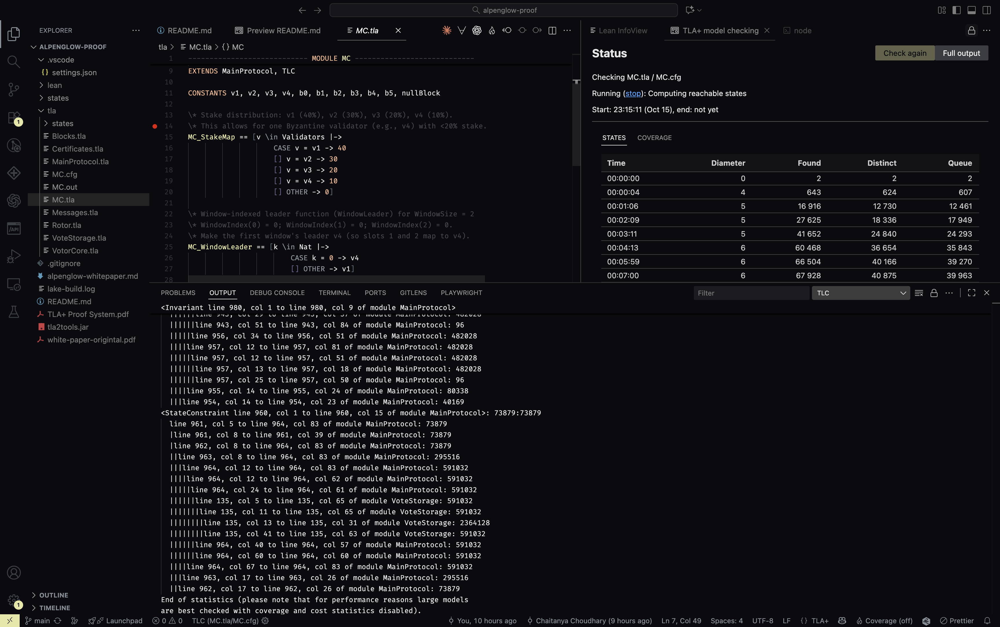
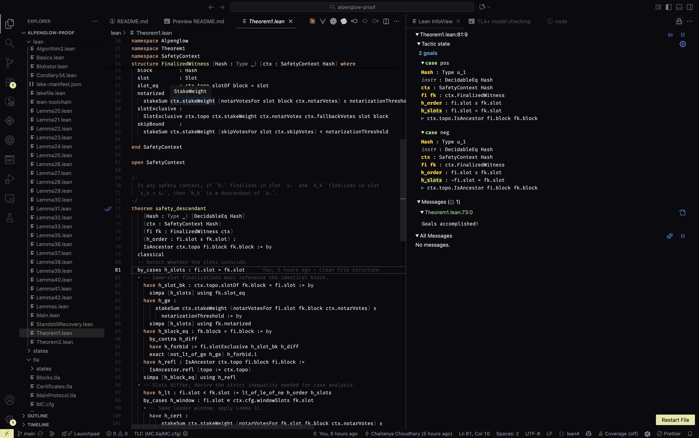

# Alpenglow Formal Verification

Formal specs and proofs for the Alpenglow consensus protocol, using TLA+ for model checking and Lean 4 for machine-checked proofs.

[](https://alpenglow-proof.vercel.app/Basics.html)

## Quick Start

Pick one path. Both work well.

- VS Code (recommended)
  - Install extensions: “TLA+” and “Lean 4”.
  - Open the repo folder in VS Code.
  - TLA+: open `tla/MC.tla`, then use “Run TLC Model Checker”.
  - Lean: open any file in `lean/` (e.g., `lean/Main.lean`). The extension builds automatically; if not, run `lake build` in `lean/`.

  TLA+ model checking example:

  

  Lean proof example:

  

- Command line
  - TLA+:
    ```bash
    java -XX:+UseParallelGC -jar tla2tools.jar -config tla/MC.cfg tla/MC.tla
    ```
  - Lean 4:
    ```bash
    cd lean
    lake build
    ```

## What’s Inside

- TLA+ models (`tla/`)
  - `MainProtocol.tla` – top-level protocol
  - `VotorCore.tla` – validator state/voting (Algorithms 1–2)
  - `Rotor.tla` – block dissemination (PS-P relay sampling)
  - `Certificates.tla` – certificate generation and thresholds
  - `VoteStorage.tla` – vote pool and storage rules
  - `Blocks.tla`, `Messages.tla` – core data and messages
  - `MC.tla`, `MC.cfg` – model setup for TLC

- Lean 4 proofs (`lean/`)
  - Algorithms: `Algorithm1.lean`, `Algorithm2.lean`
  - Core: `Basics.lean`, `Blokstor.lean`
  - Safety lemmas: `Lemma20.lean` … `Lemma42.lean`
  - Theorems: `Theorem1.lean` (safety), `Theorem2.lean` (liveness sketch)
  - Build files: `lakefile.lean`, `lean-toolchain`

The protocol is specified in `alpenglow-whitepaper.md`.

## What’s Verified

- Safety (TLA+ and Lean)
  - No conflicting finalization (Theorem 1)
  - Vote uniqueness per slot (Lemma 20)
  - Unique notarization per slot (Lemmas 23–24)
  - Correct certificate thresholds (fast 80%, slow 60%)

- Liveness (TLA+ with fairness)
  - Progress after GST (Theorem 2)
  - Windows finalize; repair eventually succeeds

Lean focuses on safety with machine-checked proofs. Liveness is exercised in TLA+.

## Run in VS Code

- TLA+
  - Install the “TLA+” extension.
  - Open `tla/MC.tla` and select “Run TLC Model Checker”.
  - Results appear in the VS Code panel; expand traces if a property fails.

- Lean 4
  - Install the “Lean 4” extension (Lean Prover Community).
  - Open any `.lean` file in `lean/`. The extension reads `lean/lean-toolchain` and installs the right toolchain.
  - Hover on terms to see types; use the infoview for goals/tactics.
  - If the server isn’t building, run `lake build` in `lean/` once.

## Repository Layout

```
alpenglow-proof/
├── tla/                     # TLA+ specifications + model configs
│   ├── MainProtocol.tla     # Main protocol model
│   ├── VotorCore.tla        # Voting logic
│   ├── Rotor.tla            # Dissemination
│   ├── Certificates.tla     # Certificate logic
│   ├── VoteStorage.tla      # Vote pool
│   ├── Blocks.tla           # Block structures
│   ├── Messages.tla         # Message types
│   ├── MC.tla               # Model wrapper
│   └── MC.cfg               # TLC configuration
├── lean/                    # Lean 4 proofs and build
│   ├── Basics.lean          # Core definitions
│   ├── Algorithm1.lean      # Timeout logic
│   ├── Algorithm2.lean      # Voting logic
│   ├── Lemma*.lean          # Safety lemmas
│   ├── Theorem1.lean        # Safety theorem
│   ├── lakefile.lean        # Lake build
│   └── lean-toolchain       # Toolchain pin
└── alpenglow-whitepaper.md  # Protocol description
```

## Notes

- TLC jar (`tla2tools.jar`) is included for convenience; you can also use the VS Code extension exclusively.
- Generated TLC states live under `states/` and `tla/states/`.
- The docs badge above points to generated Lean docs if published.

## Background

If you’re new to formal methods: TLA+ explores system behaviors to catch design bugs (model checking). Lean 4 is a proof assistant that checks mathematical proofs of properties like safety. We use both: TLA+ for rapid design checks and Lean for precise, machine-checked safety proofs.
